# Simple Docker

Введение в докер. Разработка простого докер образа для собственного сервера.

## Contents
1. [Готовый докер](#part-1-готовый-докер)
2. [Операции с контейнером](#part-2-операции-с-контейнером)
3. [Мини веб-сервер](#part-3-мини-веб-сервер)
4. [Свой докер](#part-4-свой-докер)
5. [Dockle](#part-5-dockle)
6. [Базовый Docker Compose](#part-6-базовый-docker-compose)

## Part 1. Готовый докер

1. Взять официальный докер образ с **nginx** и выкачать его при помощи `docker pull nginx`
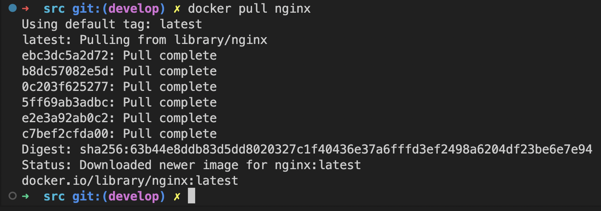

2. Проверить наличие докер образа через `docker images`
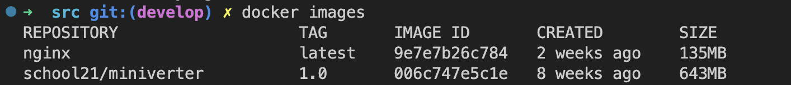

3. Запустить докер образ через `docker run -d [image_id|repository]`, где ``-d (--detach) means: Run container in background and print container ID``.
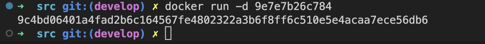

4. Проверить, что образ запустился через `docker ps` - ``List containers``

5. Посмотреть информацию о контейнере через `docker inspect [container_id|container_name]`: по выводу команды определить и поместить в отчёт список замапленных портов и ip контейнера.
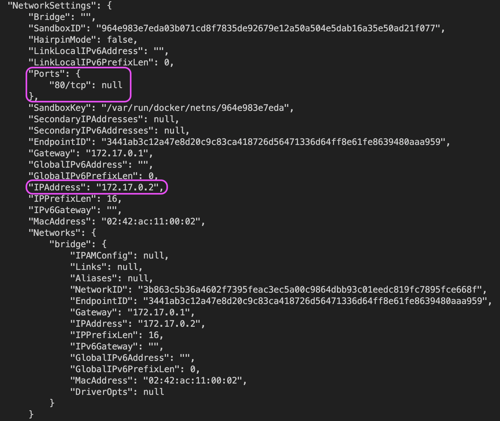

6. По выводу команды определить и поместить в отчёт размер контейнера ``docker ps -s``, где флаг ``-s (--size) means: Display total file sizes``
или `docker inspect --size [container_id|container_name]`:

>The output includes the full output of a regular docker inspect command, with the following additional fields:
>- SizeRootFs: the total size of all the files in the container, in bytes.
>- SizeRw: the size of the files that have been created or changed in the container, compared to it’s image, in bytes.

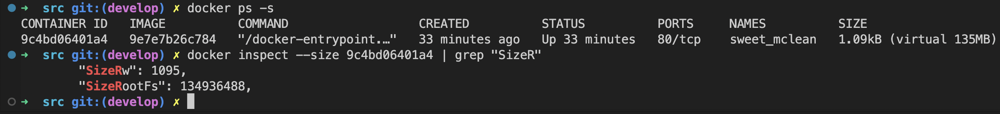

7. Остановить докер образ через `docker stop [container_id|container_name]`

8. Проверить, что образ остановился через `docker ps`
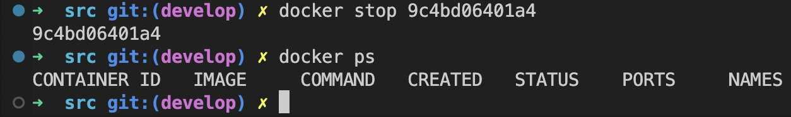

9.  Запустить докер с портами 80 и 443 в контейнере, замапленными на такие же порты на локальной машине, через команду *run*: `docker run -d -p 80:80 -p 443:443 [container_id|container_name]`, где ``-p (--publish) means: Publish a container’s port(s) to the host`` и ``--name means: Assign a name to the container``.
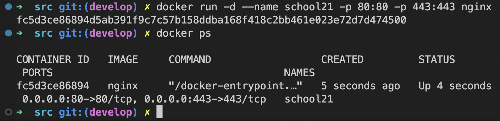

10. Проверить, что в браузере по адресу *localhost:80* доступна стартовая страница **nginx**
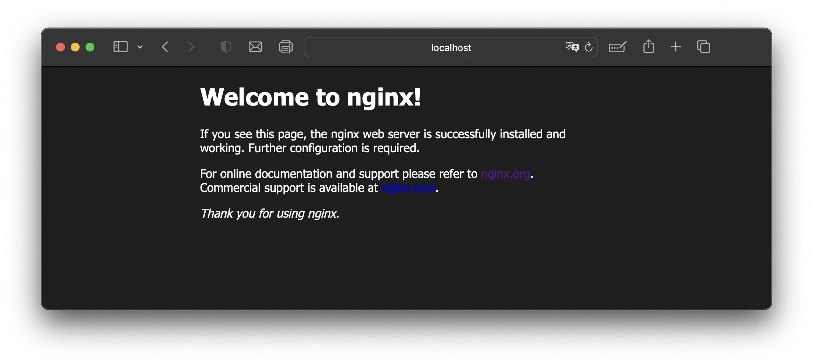

11. Перезапустить докер контейнер через `docker restart [container_id|container_name]`
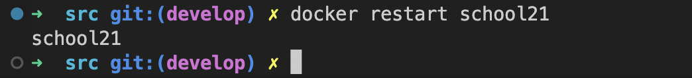

12. Проверить любым способом, что контейнер запустился
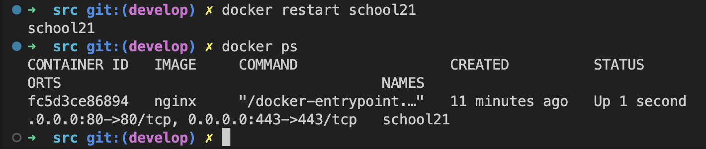

## Part 2. Операции с контейнером

Докер образ и контейнер готовы. Теперь можно покопаться в конфигурации **nginx** и отобразить статус страницы.

1. Прочитать конфигурационный файл *nginx.conf* внутри докер контейнера через команду ``exec means: Execute a command in a running container``

2. Создать на локальной машине файл *nginx.conf*

3. Настроить в нем по пути */status* отдачу страницы статуса сервера **nginx**

4. Скопировать созданный файл *nginx.conf* внутрь докер образа через команду `docker cp`
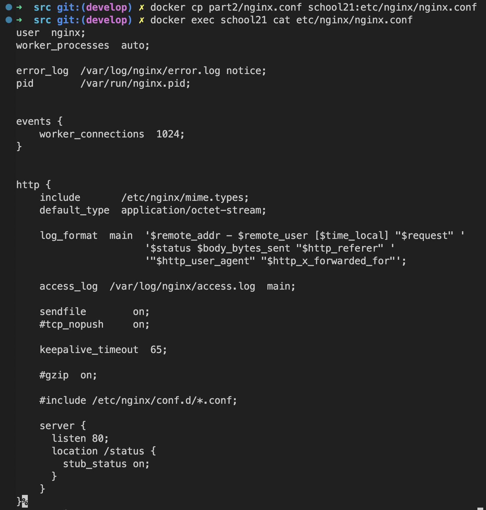

5. Перезапустить **nginx** внутри докер образа через команду *exec*
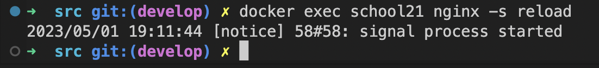

6. Проверить, что по адресу *localhost:80/status* отдается страничка со статусом сервера **nginx**
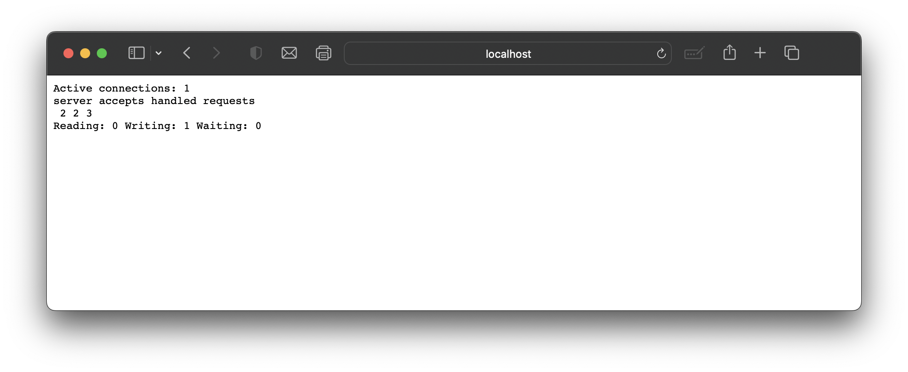

7. Экспортировать контейнер в файл *container.tar* через команду ``export means: Export a container’s filesystem as a tar archive``

8. Остановить контейнер ``docker stop ...``

9. Удалить образ через `docker rmi [image_id|repository] means: Remove one or more images`, не удаляя перед этим контейнеры
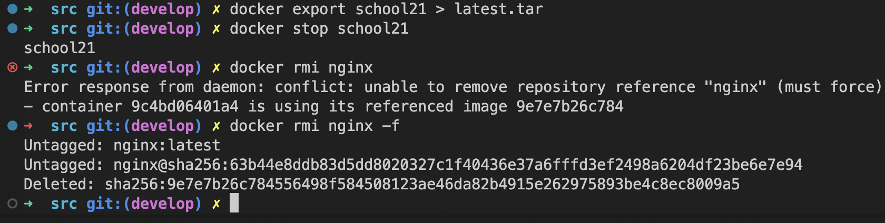

10. Удалить остановленный контейнер ``docker rm means: Remove one or more containers``
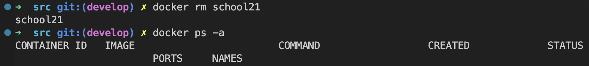

11. Импортировать контейнер обратно через команду ``docker import means: Import the contents from a tarball to create a filesystem image``
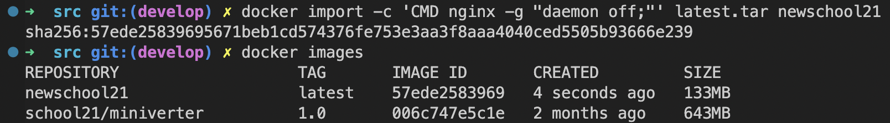

12. Запустить импортированный контейнер: `docker run -d -p 80:80 -p 443:443 [container_id|container_name]`
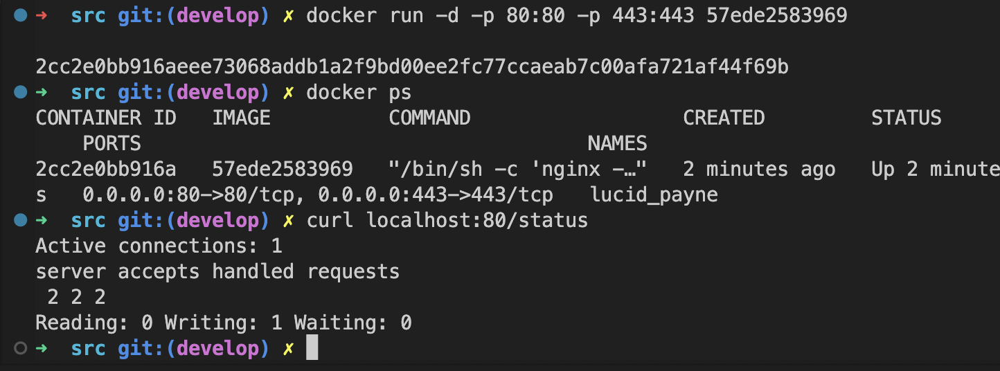

13. Проверить, что по адресу *localhost:80/status* отдается страничка со статусом сервера **nginx** или ``curl localhost:80/status``
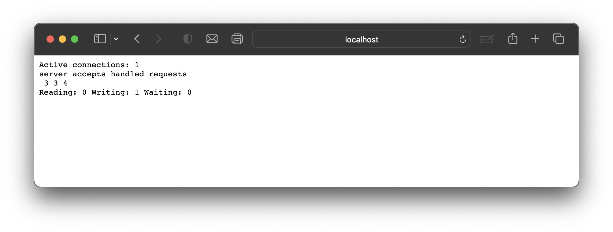

## Part 3. Мини веб-сервер

Настало время немного оторваться от докера, чтобы подготовиться к последнему этапу. Настало время написать свой сервер.

1. Написать мини сервер на **C** и **FastCgi**, который будет возвращать простейшую страничку с надписью `Hello World!`:
   - ``touch server/mini_server.c``
   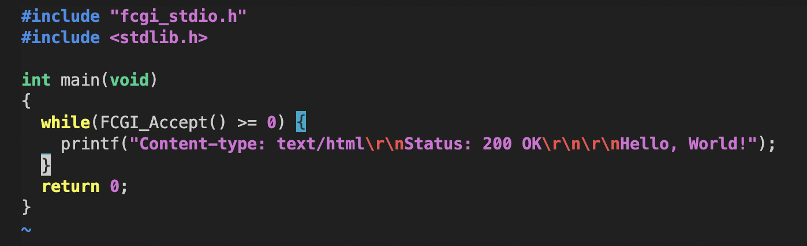

2. Запустить написанный мини сервер через *spawn-fcgi* на порту 8080
   - ``docker run -d -p 81:81 --name mini_server nginx``
  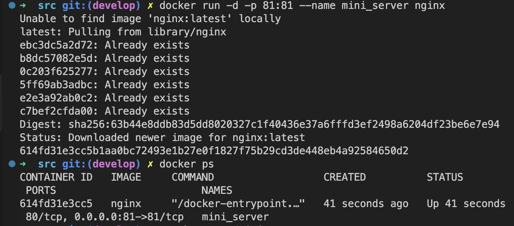
   - ``docker cp server/mini_server.c mini_server:/``
   - ``docker exec -it mini_server bash`` = зайти в командную строку контейнера
   - ``apt-get update`` = выполнить обновление
   - ``apt-get install -y gcc spawn-fcgi libfcgi-dev`` = установить необходимые пакеты
   - ``gcc mini_server.c -o mini_server -lfcgi`` = скомпилировать сервер
   - ``spawn-fcgi -p 8080 mini_server`` = запустить
  
  Здесь мы получили PID номер процесса, который можно убить командой ``kill -9 [PID number]`` при необходимости.
   - ``exit`` = выйти

4. Написать свой *nginx.conf*, который будет проксировать все запросы с 81 порта на *127.0.0.1:8080*
   - ``touch server/nginx.c``
  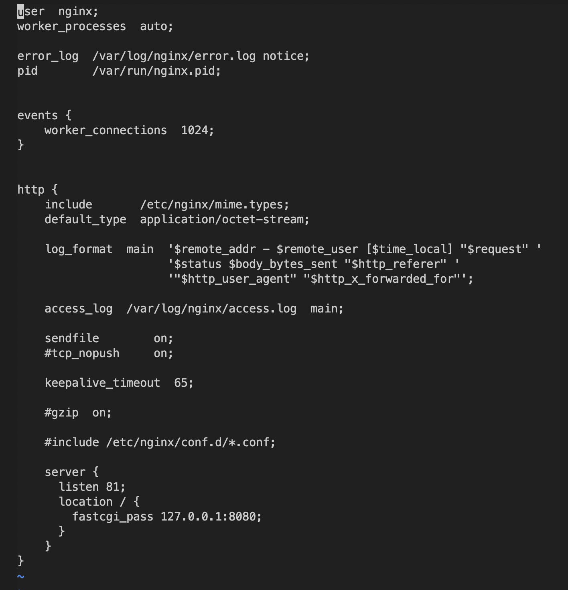
   - ``docker cp server/nginx.conf mini_server:/etc/nginx/nginx.conf``
   - ``docker exec mini_server nginx -s reload``
  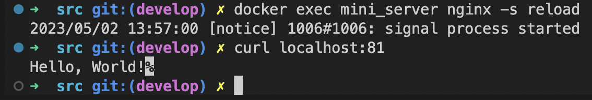

5. Проверить, что в браузере по *localhost:81* отдается написанная вами страничка
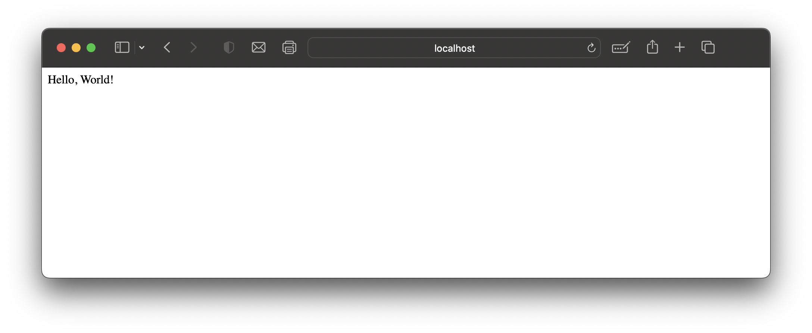

6. Положить файл *nginx.conf* по пути *./nginx/nginx.conf* (это понадобится позже)

## Part 4. Свой докер

Теперь всё готово. Можно приступать к написанию докер образа для созданного сервера.

*При написании докер образа избегайте множественных вызовов команд RUN*

1. Написать свой докер образ, который:
     -  собирает исходники мини сервера на FastCgi из [Части 3](#part-3-мини-веб-сервер)
     - запускает его на 8080 порту
     - копирует внутрь образа написанный *./nginx/nginx.conf*
     - запускает **nginx**.
_**nginx** можно установить внутрь докера самостоятельно, а можно воспользоваться готовым образом с **nginx**'ом, как базовым._
- ``touch part4/Dockerfile``
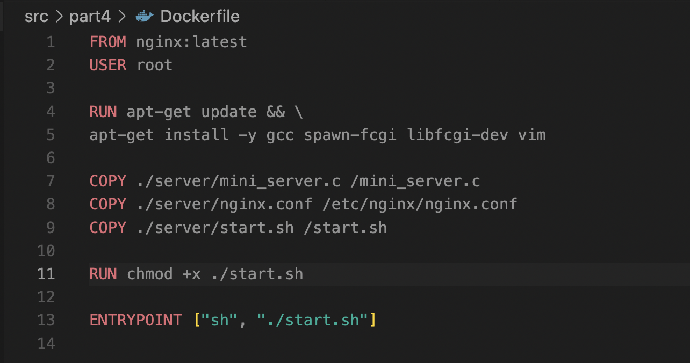
- ``cp -r server part4``
- ``cd part4 && touch server/start.sh``
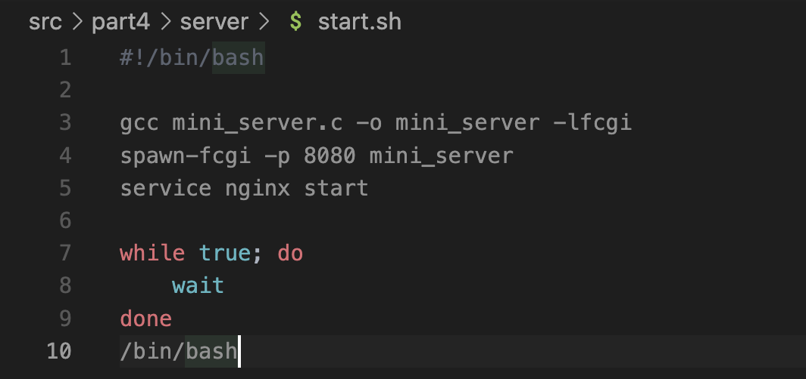

2. Собрать написанный докер образ через `docker build` при этом указав имя и тег: ``docker build -t part4:cormacsi .`` Проверить через `docker images`, что все собралось корректно
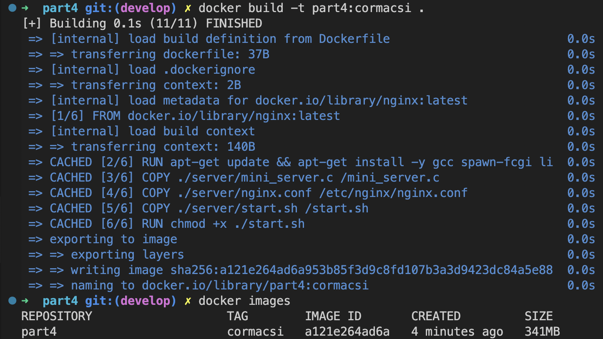

3. Запустить собранный докер образ с маппингом 81 порта на 80 на локальной машине и маппингом папки *./nginx* внутрь контейнера по адресу, где лежат конфигурационные файлы **nginx**'а (см. [Часть 2](#part-2-операции-с-контейнером)): ``docker run -d -p 80:81 --name server4 part4:cormacsi``
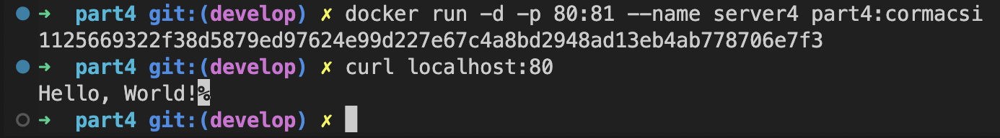

4. Проверить, что по localhost:80 доступна страничка написанного мини сервера
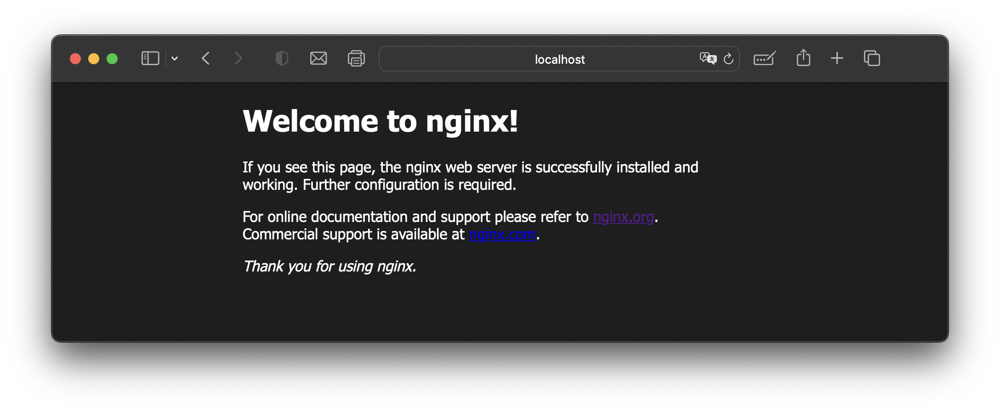

5. Дописать в *./nginx/nginx.conf* проксирование странички */status*, по которой надо отдавать статус сервера **nginx**:
   -``docker exec -it server4 bash``
   -``vim /etc/nginx/nginx.conf``
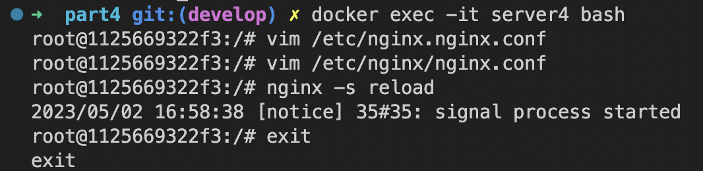

6. Перезапустить докер образ
*Если всё сделано верно, то, после сохранения файла и перезапуска контейнера, конфигурационный файл внутри докер образа должен обновиться самостоятельно без лишних действий*
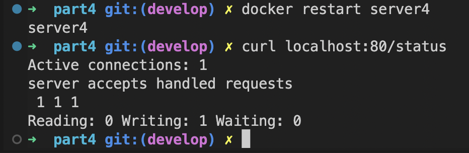

7. Проверить, что теперь по *localhost:80/status* отдается страничка со статусом **nginx**
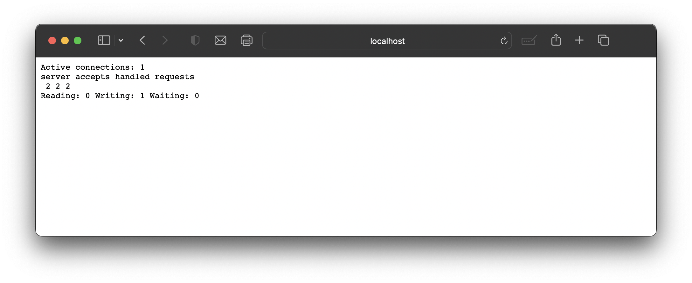

## Part 5. **Dockle**

После написания образа никогда не будет лишним проверить его на безопасность.

От меня: существует два способа запуска ``Dockle``: <a href="https://github.com/goodwithtech/dockle">ссылка на документацию на GitHub</a>.

Основной - через установку на MacOs (Intel or Apple Chip):
   - ``brew install goodwithtech/r/dockle``

Дополнительный: если вы накосячили при установке докера (он обращается к локальным файлам и не видит их) `FATAL unable to initialize a image struct: failed to initialize source: reading manifest ${TAG} in docker.io/${IMAGE_NAME}`
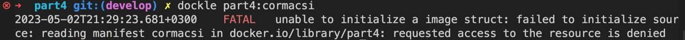
   - Решение 1: попробовать почистить docker images при помощи `docker system prune` (чистим кэш) или `docker system prune -a` (чистим все images);
   - Решение 2: запустить команду запуска контейнера ``Dockle`` совместно с проверяемым контейнером, выполнив ``sh run.sh``;
   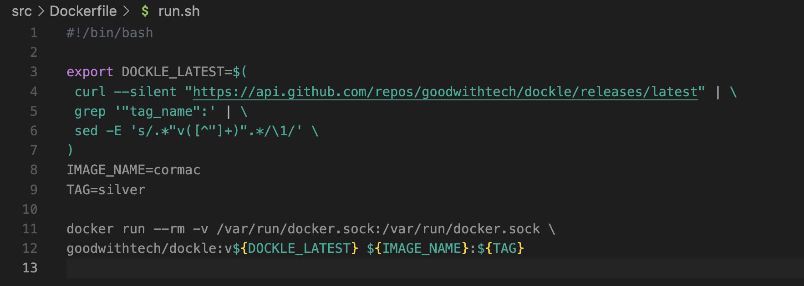
   Результат:
   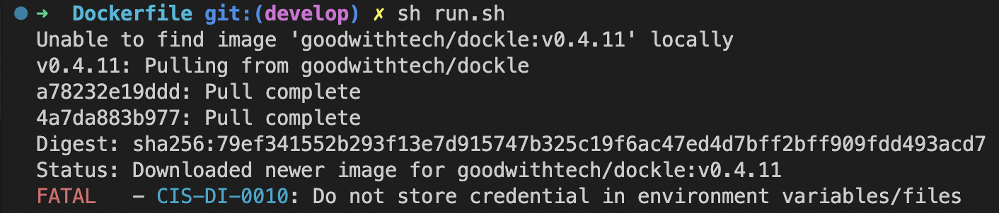
   - Решение 3: запушить на DockerHub свой репозиторий с `image`, выполнив следующее в папке Dockerfile:
     - ``docker build -t ${DOCKER_USER_NAME}/${IMAGE_NAME}:${TAG} .``
     - где `DOCKER_USER_NAME` - это имя на DockerHub (это обязательно)
     - далее выполним команду `dockle ${DOCKER_USER_NAME}/${IMAGE_NAME}:${TAG}` для удаленного репозитория, где перед названием `image:tag` стоит `username/`
   Результат:
   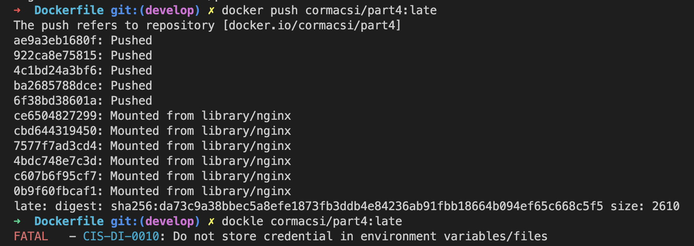
   - Решение 4: <a href="https://docs.docker.com/engine/install/">правильная установка Docker Engine</a> !без! установки `brew install docker`. Docker должен работать с терминала как только запускается приложение (для доступа к локальным файлам).
   Результат:
   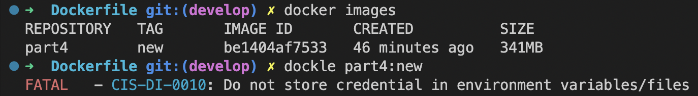

##### Просканировать образ из предыдущего задания через `dockle [image_id|repository]`
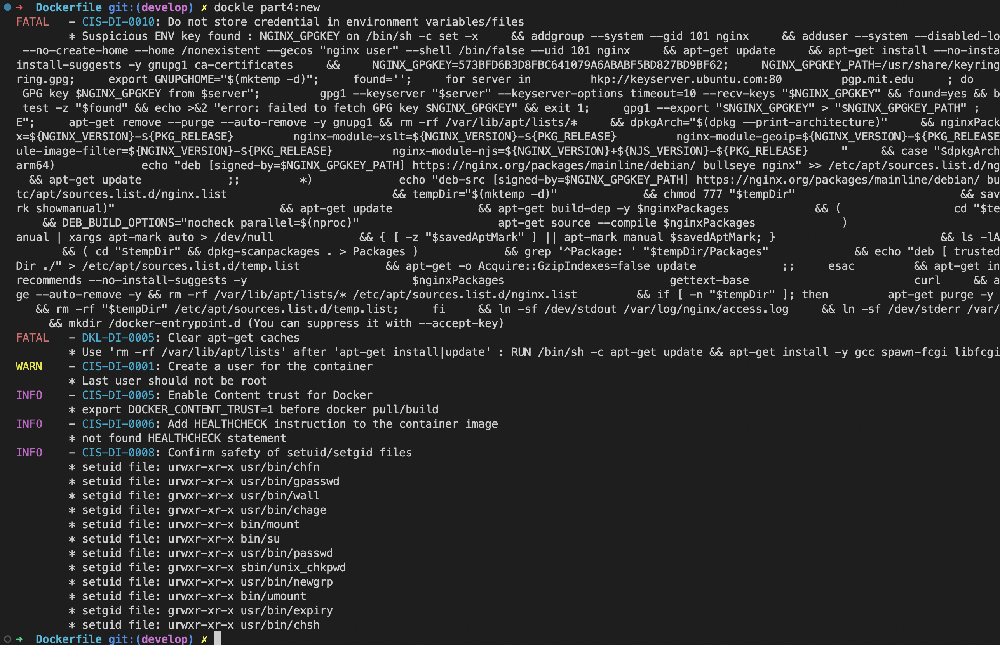
Результат:
>FATAL   - CIS-DI-0010: Do not store credential in environment variables/files
>FATAL   - DKL-DI-0005: Clear apt-get caches
>WARN    - CIS-DI-0001: Create a user for the container
>INFO    - CIS-DI-0005: Enable Content trust for Docker
>INFO    - CIS-DI-0006: Add HEALTHCHECK instruction to the container image
>INFO    - CIS-DI-0008: Confirm safety of setuid/setgid files

##### Исправить образ так, чтобы при проверке через **dockle** не было ошибок и предупреждений
`Dockerfile2/Dockerfile`:
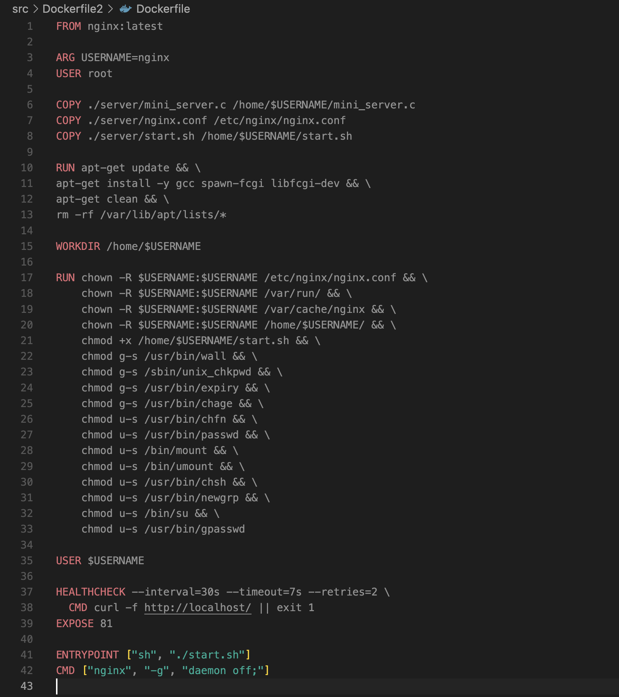

 >  - CIS-DI-0010: add flags `-ak NGINX_GPGKEY -ak NGINX_GPGKEY_PATH` when running `dockle -ak NGINX_GPGKEY -ak NGINX_GPGKEY_PATH ${IMAGE_NAME:TAG}`
 >  - DKL-DI-0005: add to Dockerfile `apt-get clean`
 >  - CIS-DI-0001: add to Dockerfile `USER $USERNAME` in the end
 >  - CIS-DI-0005: run `export DOCKER_CONTENT_TRUST=1` in terminal
 >  - CIS-DI-0006: add to Dockerfile `HEALTHCHECK with CMD`
 >  - CIS-DI-0008: Confirm safety of setuid and setgid files:
`chmod u-s setuid-file`
`chmod g-s setgid-file`
- `dockle -ak NGINX_GPGKEY -ak NGINX_GPGKEY_PATH ${USERNAME}/${IMAGE_NAME}:${TAG}`
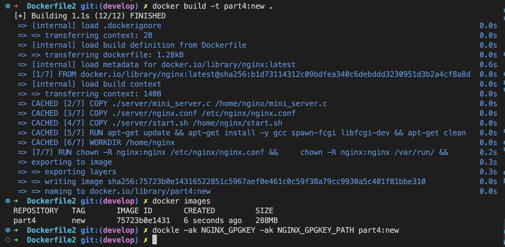
- `docker run` и `curl localhost:80`

## Part 6. Базовый **Docker Compose**

Вот вы и закончили вашу разминку. А хотя погодите...
Почему бы не поэкспериментировать с развёртыванием проекта, состоящего сразу из нескольких докер образов?

**== Задание ==**

##### Написать файл *docker-compose.yml*, с помощью которого:
##### 1) Поднять докер контейнер из [Части 5](#part-5-инструмент-dockle) _(он должен работать в локальной сети, т.е. не нужно использовать инструкцию **EXPOSE** и мапить порты на локальную машину)_
##### 2) Поднять докер контейнер с **nginx**, который будет проксировать все запросы с 8080 порта на 81 порт первого контейнера
##### Замапить 8080 порт второго контейнера на 80 порт локальной машины

##### Остановить все запущенные контейнеры
##### Собрать и запустить проект с помощью команд `docker-compose build` и `docker-compose up`
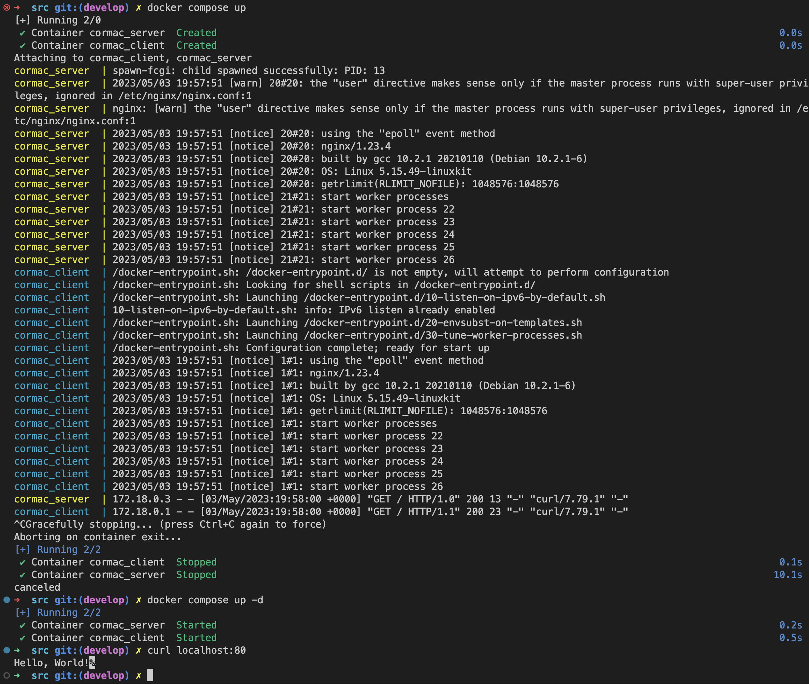
##### Проверить, что в браузере по *localhost:80* отдается написанная вами страничка, как и ранее
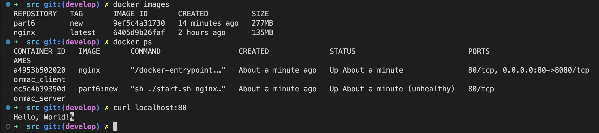

💡 [Нажми тут](https://forms.yandex.ru/cloud/6418195450569020f1f159c4/), **чтобы поделиться с нами обратной связью на этот проект**. Это анонимно и поможет команде Педаго сделать твоё обучение лучше.
